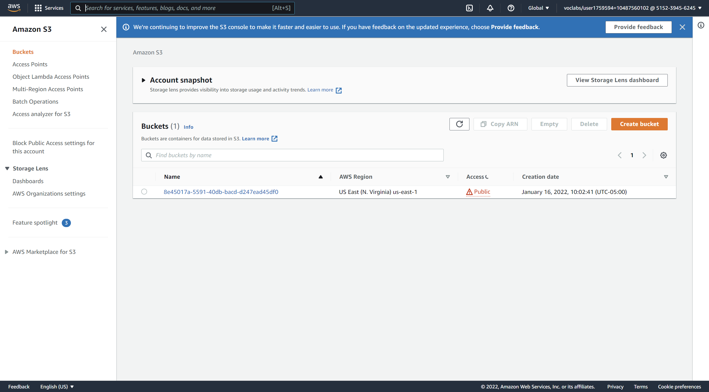
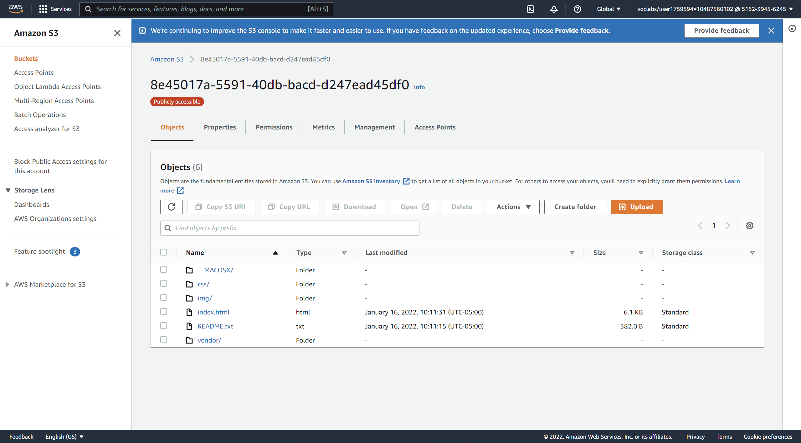
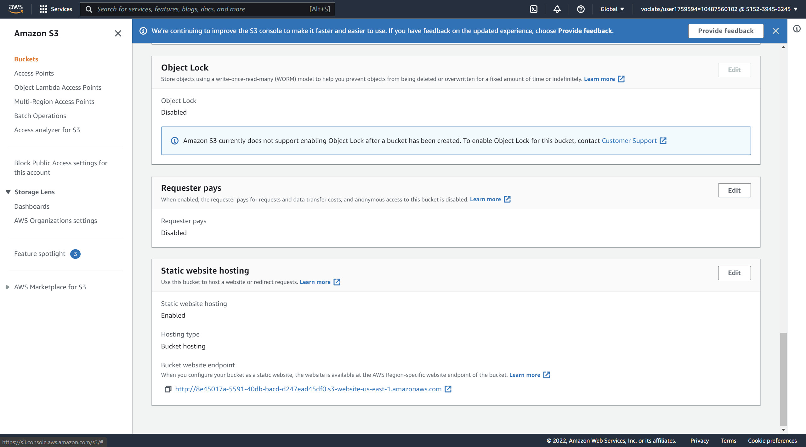
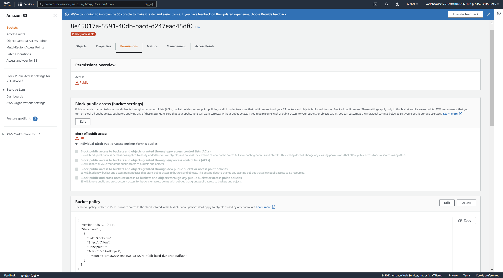
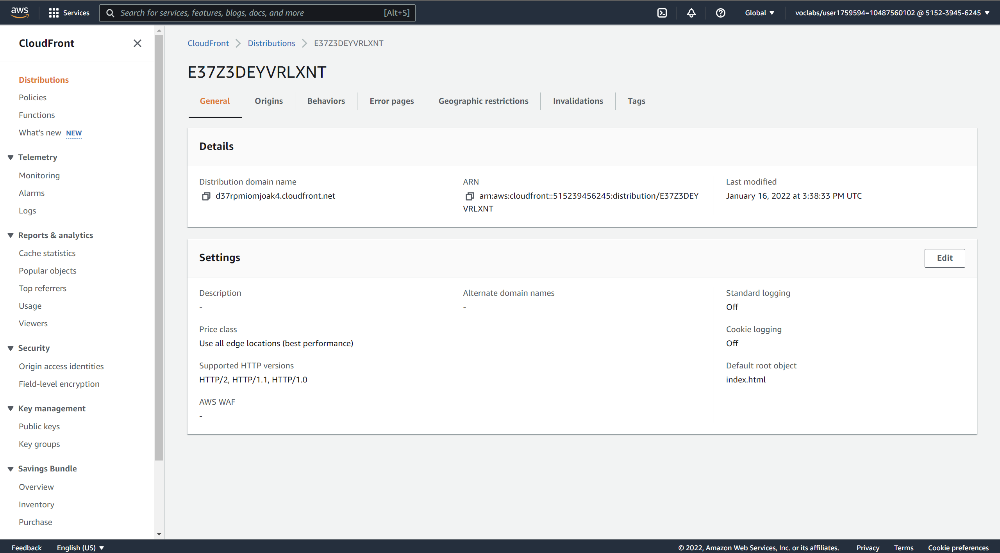
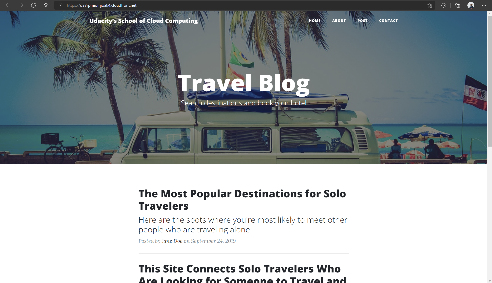
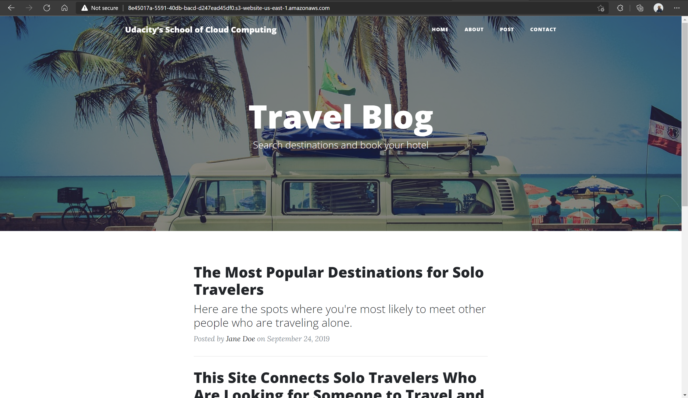

# Project - Static Website Hosting on AWS

The purpose of this project is to host a static website on AWS using S3 and CloudFront.

## Rubric Points
Below is an outline of how the rubric points have been addressed.

### Website Files
---

*Note:* The steps in this project have been completed entirely using aws cli.

*The student has created a S3 bucket.*

And S3 bucket is created with public read access:

```sh
aws s3api create-bucket --bucket 8e45017a-5591-40db-bacd-d247ead45df0 --acl public-read
```




*All website files should be added to the S3 bucket.*

The static website files are extracted to the folder called *files*. They are uploaded to the previously created AWS bucket.

```sh
aws s3 sync files/ s3://8e45017a-5591-40db-bacd-d247ead45df0
```



*The bucket configuration should be set up to support static website hosting.*

The website is set up for static website hosting using the following command, specifying the index and error documents (both direct to index.html):

```sh
aws s3 website s3://8e45017a-5591-40db-bacd-d247ead45df0/ --index-document index.html --error-document index.html
```




*The permission access to the bucket should be configured.*

A JSON policy file (`policy.json`) is created with the following content:

```json
{
"Version":"2012-10-17",
"Statement":[
 {
   "Sid":"AddPerm",
   "Effect":"Allow",
   "Principal": "*",
   "Action":["s3:GetObject"],
   "Resource":["arn:aws:s3:::8e45017a-5591-40db-bacd-d247ead45df0/*"]
 }
]
}
```

The `policy.json` file is used to set the bucket policy:

```sh
aws s3api put-bucket-policy --bucket 8e45017a-5591-40db-bacd-d247ead45df0 --policy file://policy.json
```



---

### Website Distribution

*The website should be distributed via Cloudfront.*

A CloudFront distribution is created for the website:

```sh
aws cloudfront create-distribution --origin-domain-name 8e45017a-5591-40db-bacd-d247ead45df0.s3-website-us-east-1.amazonaws.com --default-root-object index.html
```



---

### Web Browser Access

*Is the website publicly accessible?*

The website is accessible via the following url's:
- CloudFront: https://d37rpmiomjoak4.cloudfront.net
- S3: http://8e45017a-5591-40db-bacd-d247ead45df0.s3-website-us-east-1.amazonaws.com



